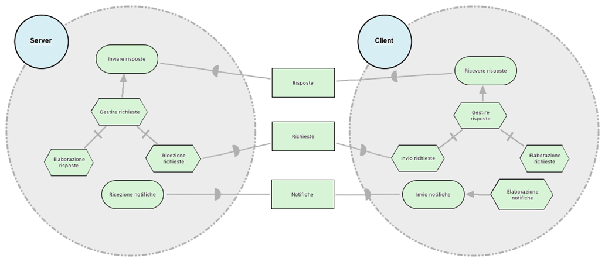
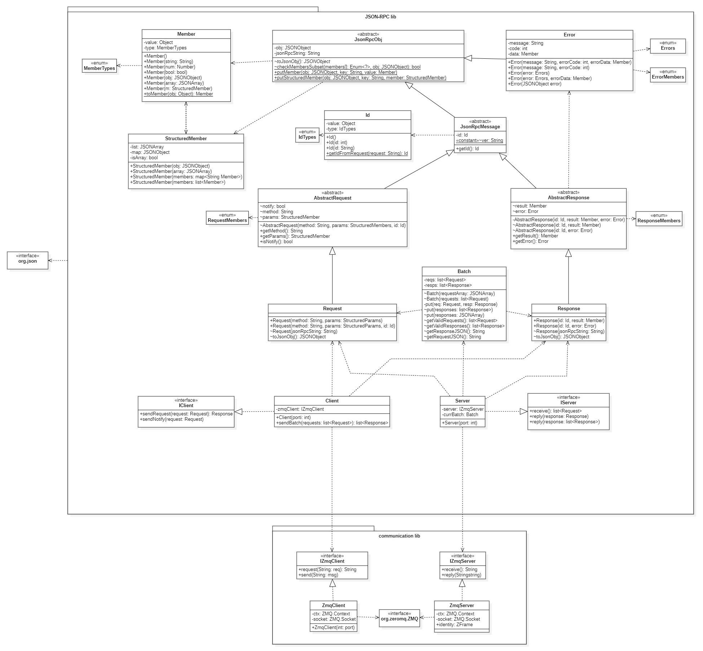

# JSON-RPC 2.0 Java library
Project for Software Engineering at Polimi. Java library for use of JSON-RPC 2.0 communication protocol.

This module is part of a bigger project that uses this library for remote communication between clients and a server in order to request and give authorizations to specific users for specific resources.

This library implements JSON-RPC 2.0 communication protocol (spec: https://www.jsonrpc.org/specification) over sockets, using ZeroMQ.

#Goal Diagram
 
The server and the client are the actors. Receiving and sending requests, notifications and responses are the goals of the serves and the client. These goals are reached thanks to the showed tasks. 
The diagram was required to be in Italian.

#Data Dictionary

| Name         | Description                                                                                                                                                                                                 | Relations | Examples                                                                                                                                 | Attributes                                       |
| ------------ | ----------------------------------------------------------------------------------------------------------------------------------------------------------------------------------------------------------- | --------- | ---------------------------------------------------------------------------------------------------------------------------------------- | ------------------------------------------------ |
| Request      | Rpc call from a client to a server. It specifies the json rpc version (2.0), the method to call, necessary parameters and an ID                                                                             |           | {"jsonrpc": "2.0", "method": "subtract", "params": \[42, 23\], "id": 1}  {"jsonrpc": "2.0", "method": "foobar", "id": "1"}         | jsonrpc (always “2.0”) method params id |
| Response     | Server response to a request (not notification) from a client. It specifies the json rpc version (2.0) and the ID of the referring request. It contains either the result of the called method or an error. | Error     | {"jsonrpc": "2.0", "result": 19, "id": 1}  {"jsonrpc": "2.0", "error": {"code": -32601, "message": "Method not found"}, "id": "1"} | jsonrpc (always “2.0”) result / error id   |
| Notification | ID-less request. It's a request that doesn't require a response.                                                                                                                                            |           | {"jsonrpc": "2.0", "method": "update", "params": \[1,2,3,4,5\]}  {"jsonrpc": "2.0", "method": "foobar"}                            | jsonrpc (always “2.0”) method params       |
| Error        | It's one of the member in a response when the server encounters an error. It specifies the type of error with a code, an error message and optionally other meta-data about the error.                      | Response  | "error": {"code": -32601, "message": "Method not found"}  "error": {"code": -32700, "message": "Parse error"}                      | code message data                          |

#Class Diagram
